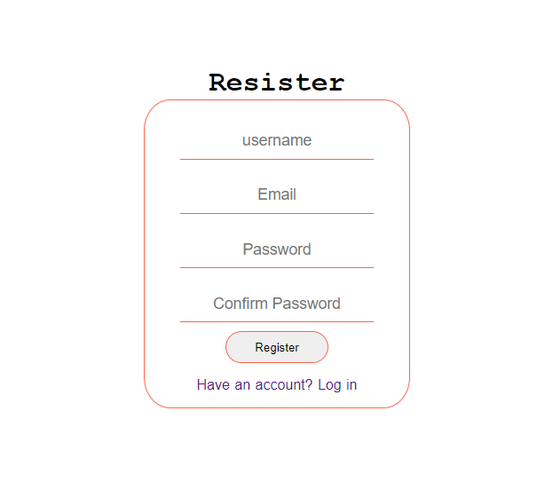
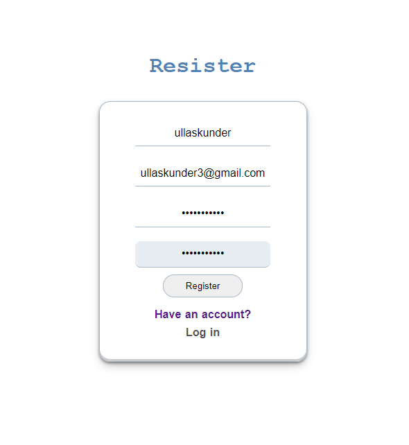

# Implementing authentication with nodeJs and PostgreSQL

## UI using html, css

example

|      register        |     login             |
|----------------------|-----------------------|
|| |

open

```bash
    psql -U postgres -d postgres
```

creating user

```bash
CREATE USER ullasDB WITH PASSWORD 'ullasdb1' CREATEDB;
```

connecting to user db

```bash
psql -U ullasdb -d postgres
```

creating database

```bash
CREATE DATABASE nodeuserlogin;
```

listing the database

```bash
\l
```

connect to db

```bash
\c nodeuserlogin
```

creating table

```bash
CREATE TABLE users
```

```bash
nodeuserlogin-> (id BIGSERIAL PRIMARY KEY NOT NULL,
nodeuserlogin(> name VARCHAR(200) NOT NULL,
nodeuserlogin(> email VARCHAR(200) NOT NULL,
nodeuserlogin(> password VARCHAR(200) NOT NULL,
nodeuserlogin(> UNIQUE (email));
```

check

```bash
nodeuserlogin=> \d users
                                     Table "public.users"
  Column  |          Type          | Collation | Nullable |              Default
----------+------------------------+-----------+----------+-----------------------------------
 id       | bigint                 |           | not null | nextval('users_id_seq'::regclass)
 name     | character varying(200) |           | not null |
 email    | character varying(200) |           | not null |
 password | character varying(200) |           | not null |
Indexes:
    "users_pkey" PRIMARY KEY, btree (id)
    "users_email_key" UNIQUE CONSTRAINT, btree (email)
```
